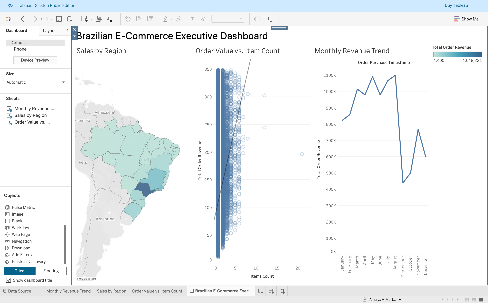

# 🛒 Clean-Extract-Visualize: Retail Data Pipeline

### 🔗 [View Live Tableau Dashboard Here](https://public.tableau.com/views/BrazilianE-CommerceExecutiveOverview/Dashboard1?:language=en-US&:sid=&:redirect=auth&publish=yes&showOnboarding=true&:display_count=n&:origin=viz_share_link)

## 📌 The Problem
Raw e-commerce data is often fragmented across multiple tables and filled with anomalies (outliers, missing values, and inconsistent date formats). Executives need a high-level view of revenue trends and regional performance, but manual cleaning in Excel is unscalable and error-prone.

## ⚙️ The Solution
I built a professional-grade data pipeline that automates the transformation of raw CSVs into an interactive executive dashboard.

### The Workflow:
1.  **SQL (Extract):** Joined three relational tables (Customers, Orders, and Items) in SQLite to calculate order-level revenue and filter for delivered status.
2.  **Python OOP (Clean):** Developed a reusable `DataCleaner` class to handle nulls, convert datetime objects, and remove price outliers using the **Interquartile Range (IQR)** method.
3.  **Tableau (Visualize):** Designed a 3-part dashboard showing Monthly Revenue Trends, Regional Sales via a Geographic Heatmap, and Order Composition.

## 📊 Dashboard Preview

## 🛠️ How to Run
1. Clone this repo.
2. Download the [Olist Brazilian E-Commerce Dataset](https://www.kaggle.com/datasets/olistbr/brazilian-ecommerce).
3. Run `python3 main.py` to generate the `ecommerce_final_tableau.csv`.
